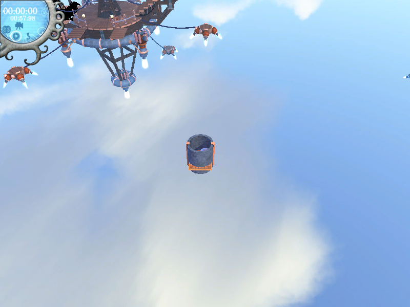
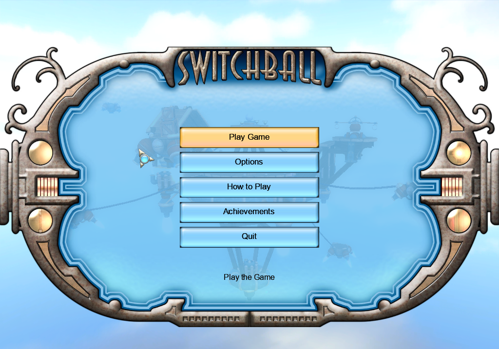

# SBTool (Switchball Tool)

## Description:

Do the first two images seem similar?
That's because it's the level shown in the main menu!
Using SBTool, I replaced the first sky world level with the level shown in the main menu.
Then, I was able to play it by clicking on the first sky world level.

SBTool is a tool that can extract and create batch files from the game Switchball.
Switchball stores all of its resources in a file called switchball.batch.
This file is an archive file that is extracted into memory upon runtime, so the game can access its resources. Using SBTool, it is possible to access and modify resources inside the archive file.
This means you can essentially mod the game :)

## Compilation Requirements:

- Basic *NIX setup, or sad Windows imitation ([MinGW](http://mingw.org/), [Cygwin](https://cygwin.com/), [Bash for Windows](https://msdn.microsoft.com/en-us/commandline/wsl/about), etc.)

## Compiling:

To compile SBTool, run `make` in the top level directory.
This should generate a file called sbtool in the bin/ directory.

## Usage:

Run SBTool from the command line like so:

`sbtool [Options]`

Options:

- `-h, --help`: display usage and exit
- `-l, --list <file>`: list files in archive
- `-e, --extract <archive>`: extract files from archive
- `-c, --create <name> <directory>`: create archive

## Note:

fin.c was derived from a C version of the orignal assembly program,
which was written by Jussi Puttonen, 19.4.1991 at University of Turku, Finland.
Algorithms suggested by Timo Raita and Jukka Teuhola.

I derived the extraction and creation process with help from a [QuickBMS Script](http://aluigi.altervista.org/bms/switchball.bms).
Thank you Luigi Auriemma!

## .batch File Layout:

Switchball batch files are composed as following:

### Main Header:

signature (string) [size: 20]: "THIS IS A BATCH FILE"

padding (bytes) [size: 12]: 00 00 00 00 00 00 00 00 00 00 00 00

number of entries (dword)

### Entries [size: number of entries]:

data offset (dword) [relative to start of file]

data size (dword)

path size (dword)

path (string) [size: path size]

### Data [size: number of entries]:

signature (string) [optional]: "VNZ"

compressed size (dword) [optional]

uncompressed size (dword) [optional]

data (bytes) [size: data size]

### Note:

All data entries are encrypted.
If a data entry begins with "VNZ", it is compressed as well.
